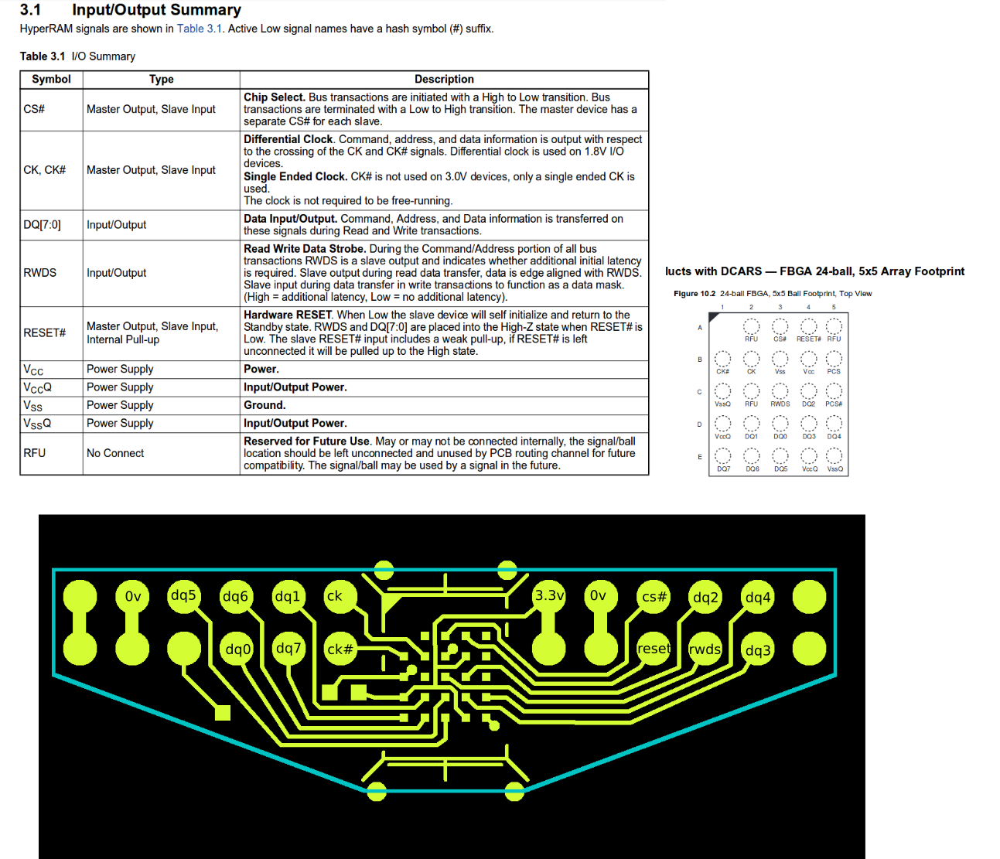

# hyperram
Portable Verilog RTL interface to S27KL0641DABHI020 64Mbit HyperRAM IC

This is an open-source RTL project for a simple DWORD burst interface to a Cypress [S27KL0641DABHI020 64Mbit HyperRAM](http://www.cypress.com/part/s27kl0641dabhi020).

hr_pll.zip is the version for Xilinx 7-Series that runs at full FPGA fabric clock rate.  The normal clear RTL version runs at FPGA fabric clock divided by 4 to achieve the 90 degrees phase shift for clock and the DDR data rates.  The Xilinx 7-Series uses Xilinx specific primitives ( ODDRs, IDDRs ) and has a slightly different core interface.

Also included is a dual-PMOD PCB adapter design.

@OSHPark Shared Project: https://oshpark.com/shared_projects/oZ3pCvob

Kevin Hubbard - Black Mesa Labs 2018.04.28
